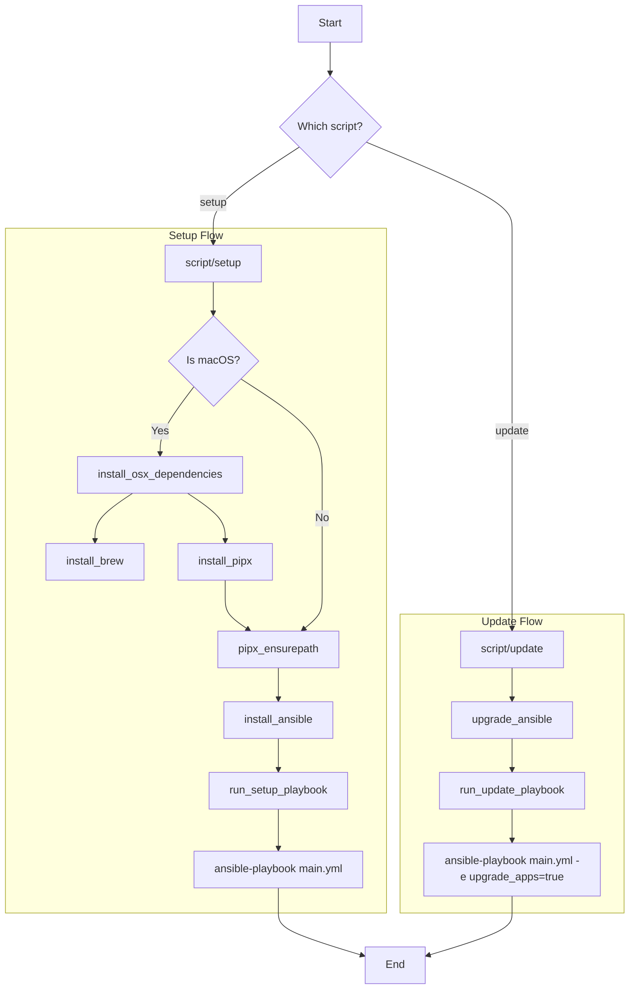

# Ansible Playbooks

### First Time Setup
Run `script/setup` to setup a new Mac OS X machine with all tools and applications installed.

### Updating Applications
Run `script/update` to update all installed applications.

This will take longer than running `script/setup` because it checks for updates for all installed applications.

### Implementation

The project is structured with modular shell scripts to handle environment preparation and Ansible for system configuration.

- **`script/setup`**: The entry point for initial machine setup.
- **`script/update`**: The entry point for updating existing applications and Ansible.
- **`script/osx`**: Contains macOS-specific dependency installation (`brew`, `pipx`).
- **`script/ansible`**: Contains shared Ansible-related tasks (`pipx_ensurepath`, `install_ansible`, `run_setup_playbook`, `run_update_playbook`).
- **`script/echo`**: Utility functions for color-coded output.

#### Control Flow

